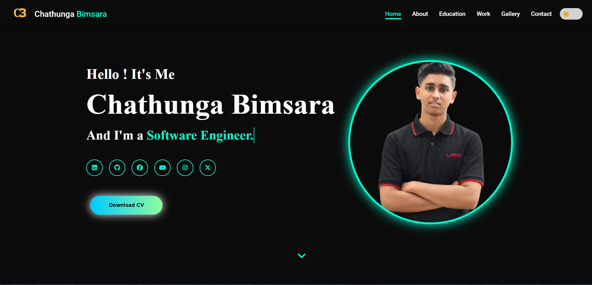

# 🌟 Chathunga Bimsara | Personal Portfolio

## 📖 About Me
**Undergraduate Software Engineer & Aspiring Full Stack Developer**

Hello, I’m Chathunga Bimsara. I began my journey in Software Engineering in 2025, when I joined IJSE - Institute of Software Engineering. Since then, I’ve been dedicating my time to learning, practicing, and building a strong foundation in software development. 

- 💻 **Roles:** Software Engineer, Frontend Developer, Full-Stack Developer, Content Creator
- 🎂 **Date of Birth:** November 02, 2007
- 📍 **Location:** Ampegama, Galle, Sri Lanka

## 🛠️ Key Skills

  
  
  
  
  
  
  

## 🎓 Education & Qualifications

| Institution | Duration | Description |
| ----------- | -------- | ----------- |
| **Institute of Java Software Engineering (IJSE)** | 2025 - Present | Higher National Diploma in Software Engineering |
| **Sri Lanka English Graduate's Association** | 2025 | English Graduate Certification & Diploma |
| **G/ Ethkandura Seewali M.V National College** | 2013 - 2024 | O/L Examination with ICT proficiency |

## 🚀 Featured Projects

- 💻 **[Stock System](https://github.com/chathunga2007/PRF-Project)** - Terminal-based Application.
- 🎮 **[Connect 4 Game](https://github.com/chathunga2007/Connect_Four_Game-Assignment-OOP-)** - Entertainment Application.
- 🏋️ **[Flex Gym System](https://github.com/chathunga2007/Gym_Membership_Management_System-1st-Semester-Final-Project-Using-MVC-Architecture-)** - Standalone MVC Application.

## 🔗 Project Links & Resources
*The following links contain the design and planning resources for this portfolio project (ITS1119-Web-Technologies-Exercise 05):*
- **Live Preview:** [My Personal Portfolio](https://chathunga2007.github.io/My-Personal-Portfolio-WebPage/)
- **Side Map:** [Gloomaps](https://www.gloomaps.com/fyZGFPNvmR)
- **Wireframe:** [Diagrams.net](https://app.diagrams.net/#G1Ngnmv88UrGTSzOU7uYdSw8raLsIPDjim#%7B%22pageId%22%3A%221XPUu_R75vPcrxgwMtCx%22%7D)
- **Portfolio Mockups:** [Figma Design](https://www.figma.com/design/lObfpoO3qAU8Heyuy43jZV/Personal-Portfolio-Mockups?node-id=173-1283&t=ALB8JsAKw1iH6GIL-1)

## 📫 Connect With Me

  
  
  
  

---
*© 2026 Chathunga Bimsara | All rights reserved.*
